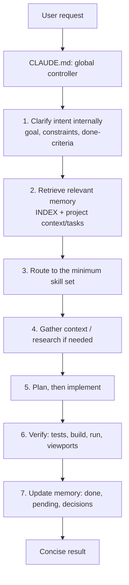

# Claude Engineering Skills

A portable, global skill system for [Claude Code](https://claude.com/claude-code). It turns Claude Code into one engineering, design, content, and research assistant that:

- **routes itself:** picks only the skills a task needs, with no manual skill selection
- **remembers projects:** keeps compact context, decisions, and pending work between sessions
- **stays lean:** loads detail only when needed, to keep token use low
- **stays auditable:** every third-party file is pinned, licensed, and documented

Install once per computer and it applies to **every project** on that computer.

---

## Contents

- [Capabilities](#capabilities)
- [Architecture](#architecture)
- [Repository structure](#repository-structure)
- [Requirements](#requirements)
- [Installation](#installation)
- [Verify the installation](#verify-the-installation)
- [How it works in practice](#how-it-works-in-practice)
- [Global defaults](#global-defaults)
- [Memory system](#memory-system)
- [Security and third-party material](#security-and-third-party-material)
- [Maintenance](#maintenance)
- [Uninstall](#uninstall)
- [Troubleshooting](#troubleshooting)
- [License](#license)

---

## Capabilities

The system covers 11 core capabilities with 14 modular skills.

| Capability | Skill(s) | Implementation |
|---|---|---|
| Engineering | `CLAUDE.md` workflow + `debugging`, `testing`, `security` | In-house + adapted hard-bug reference |
| Prompt engineering / optimization | `CLAUDE.md` intent step + `prompt-engineering` | In-house |
| UI/UX design (web, Android, iPhone) | `ui-ux-design` | In-house + adapted platform references |
| Frontend development | `web-development` (+ React/Next.js and responsive references) | In-house + copied references |
| Motion and animation | `motion` (+ official GSAP references) | In-house + copied references |
| Three.js / 3D web | `threejs-3d` | In-house |
| Visual / image direction | `visual-direction` | In-house |
| SEO and website content | `seo-content` | In-house + adapted references |
| Backend / CMS (any stack) | `web-development` (+ Postgres references) | In-house + copied references |
| Design diversity (anti-generic design) | `frontend-design` | Copied from Anthropic, unmodified |
| Research (quick / standard / deep, resumable) | `research` | In-house + adapted verification references |

Additional domain skills: `web3-development` (Solidity, dApps, Hardhat/Foundry) and `automation-bots` (scrapers, bots, scheduled jobs, messaging).

---

## Architecture



### Layers and token cost

Only the first two layers load in every session. Everything else loads on demand.

| Layer | Location | Loaded | Purpose |
|---|---|---|---|
| Controller | `CLAUDE.md` → `~/.claude/CLAUDE.md` | Every session | Priority, workflow, routing, memory, research, safety, global defaults |
| Skill descriptions | `description:` in each `SKILL.md` | Every session (one line each) | Lets Claude decide which skill applies |
| Skill body | `skills/<name>/SKILL.md` | Only when the task matches | Domain rules |
| References | `skills/<name>/references/` | Only when the skill points to them | Detailed guides, API notes, examples |
| Memory index | `memory/INDEX.md` | At the start of project work | Maps a project folder to its memory |
| Memory files | `memory/projects/<slug>/` | Only the current project's core files; others by search | Context, tasks, decisions, research, sessions |

### Routing examples

| Task | Skills loaded |
|---|---|
| Marketing website | `ui-ux-design` → `frontend-design` → `visual-direction` → `web-development` (+ `motion`, `threejs-3d`, `seo-content` when in scope) → `testing` |
| dApp | `web3-development` + `security` + `testing` (+ design and `web-development` skills for the UI) |
| Backend bug | `web-development` + `debugging` (+ `testing`, `security` when relevant) |
| Research question | `research` |

When skills disagree, `security` wins on security, project conventions beat design defaults, and accessibility beats visual novelty.

---

## Repository structure

```
claude-engineering-skills/
├── CLAUDE.md                 Global controller (installed to ~/.claude/CLAUDE.md)
├── README.md
├── docs/
│   ├── maintenance.md        Architecture, skill standard, third-party intake checklist
│   └── third-party.md        Registry of every copied file: source, license, commit, changes
├── memory/
│   ├── README.md             Memory format and rules (tracked)
│   ├── _template/            Templates for new projects (tracked)
│   ├── INDEX.md              Your project index (local only, gitignored)
│   ├── global/               Cross-project preferences and decisions (local only)
│   └── projects/<slug>/      Per-project memory (local only)
├── scripts/
│   └── validate.py           Repository validator (Python standard library, no network)
└── skills/
    ├── automation-bots/   debugging/        frontend-design/   motion/
    ├── prompt-engineering/ research/        security/          seo-content/
    ├── testing/           threejs-3d/       ui-ux-design/      visual-direction/
    └── web-development/   web3-development/
```

Each skill folder holds a `SKILL.md`. It may also hold a `references/` folder, and skills with third-party material also have `SOURCE.md` and the original LICENSE/NOTICE files.

---

## Requirements

- **Claude Code**, installed and signed in (`claude --version`)
- **Git** (`git --version`; download from https://git-scm.com)
- **Python 3**, only for running the validator (`python --version`)

> **Already have a personal `~/.claude/CLAUDE.md`?** The install step replaces it and saves the previous file as `CLAUDE.md.bak`. Move any rules you want to keep into this repo's `CLAUDE.md`, above the `## This repo` line.

---

## Installation

The installed copies are a snapshot of the repo. Run every command from inside the repo folder.

### Windows (PowerShell)

**1. Clone the repository** (any location; this example uses `D:\Desktop\Important files`)

```powershell
cd "D:\Desktop\Important files"
git clone https://github.com/ShamratX/claude-engineering-skills.git
cd claude-engineering-skills
```

**2. Install the skills**

```powershell
New-Item -ItemType Directory -Force "$HOME\.claude\skills" | Out-Null
Copy-Item -Recurse -Force skills\* "$HOME\.claude\skills\"
```

**3. Install the global rules and connect the memory store**

```powershell
if (Test-Path "$HOME\.claude\CLAUDE.md") { Copy-Item "$HOME\.claude\CLAUDE.md" "$HOME\.claude\CLAUDE.md.bak" }
$mem = (Resolve-Path memory).Path -replace '\\','/'
$lines = Get-Content -Encoding utf8 CLAUDE.md
$end = [array]::IndexOf($lines, '## This repo')
$lines[0..($end-1)] -replace '\{\{MEMORY_ROOT\}\}', $mem | Set-Content -Encoding utf8 "$HOME\.claude\CLAUDE.md"
```

This removes the repo-only `## This repo` section and writes the memory folder's absolute path into the installed rules.

**4. Restart Claude Code.**

> On Windows, use these PowerShell commands even if you prefer Git Bash: step 3 in Git Bash writes the memory path as `/d/...`, which Windows tools and the validator don't match.

### macOS / Linux

**1. Clone the repository**

```bash
cd ~
git clone https://github.com/ShamratX/claude-engineering-skills.git
cd claude-engineering-skills
```

**2. Install the skills**

```bash
mkdir -p ~/.claude/skills
cp -r skills/* ~/.claude/skills/
```

**3. Install the global rules and connect the memory store**

```bash
[ -f ~/.claude/CLAUDE.md ] && cp ~/.claude/CLAUDE.md ~/.claude/CLAUDE.md.bak
sed -e '/^## This repo/,$d' -e "s|{{MEMORY_ROOT}}|$(pwd)/memory|" CLAUDE.md > ~/.claude/CLAUDE.md
```

**4. Restart Claude Code.**

---

## Verify the installation

1. In the repo folder, run:
   ```
   python scripts/validate.py --installed
   ```
   Expected result: `14 skills, 0 errors`. This confirms that every installed file matches the repo and that the installed `CLAUDE.md` has a real memory path.
2. In Claude Code, run `/memory`. The list should include `~/.claude/CLAUDE.md`.
3. Ask Claude Code: *"Which skills from ~/.claude/skills do you have?"* It should list all 14.

---

## How it works in practice

You don't name skills or write detailed prompts. Describe the work and Claude:

1. Restates your request internally as goal, constraints, and done-criteria. It keeps your intent and adds no scope.
2. Loads the project's memory, so it knows what's done, pending, and decided.
3. Loads only the relevant skills and makes the routine decisions itself: UX, visuals, motion, content, SEO.
4. Verifies the result and states anything it couldn't check.
5. Updates the project's memory with completed and pending work.

Example: *"Continue the project"* the next day picks up from the pending tasks recorded in memory.

---

## Global defaults

These apply to every website, web app, dApp, frontend, and backend project unless you ask otherwise:

| Default | Rule |
|---|---|
| **Responsive design** | Every UI works on mobile, tablet, laptop, and desktop. It is checked at 360, 768, 1024, and 1440 px. |
| **JavaScript** | No TypeScript unless requested. Existing TypeScript projects stay TypeScript. |
| **No Python** | Only when genuinely required with no reasonable alternative, and the reason is stated. |
| **Clean projects** | No leftover screenshots, mockups, temporary assets, dead code, or unneeded files or dependencies. Pre-existing files are only removed after asking. |
| **Accuracy** | No invented APIs, versions, facts, sources, or business details; unverified claims are labeled. |
| **Safety** | No secrets in code or memory. Irreversible or outward actions require confirmation. |
| **Original design** | Each UI project gets its own visual direction (recorded in memory); no reused or generic AI layouts across projects. An existing brand or design system wins. |
| **Icons** | One consistent, maintained icon family per project; no emoji icons; official brand logos only; only the icons used are imported. |

Project conventions and explicit requests always take precedence. The full order is defined under **Priority** in `CLAUDE.md`.

---

## Memory system

Plain Markdown files, with no database, service, or dependency.

| File | Content |
|---|---|
| `INDEX.md` | One row per project: slug, folder path, status |
| `projects/<slug>/context.md` | Purpose, stack, architecture, constraints |
| `projects/<slug>/tasks.md` | Pending work, known issues, recently completed work |
| `projects/<slug>/decisions.md` | Decisions with reasons (superseded ones are kept and marked) |
| `projects/<slug>/research.md` | Research conclusions with source and review-by date |
| `projects/<slug>/research/<topic>.md` | Resumable notes for deep research |
| `projects/<slug>/sessions.md` | Short session summaries (newest 10) |
| `global/` | Cross-project preferences and decisions |

- **Token-efficient:** each session reads `INDEX.md` plus the current project's `context.md` and `tasks.md`. Other files are searched, not loaded. Full conversations are never stored.
- **Trustworthy:** entries are dated and tagged `confirmed` or `unverified`. Claude checks a remembered fact before relying on it.
- **Secret-free:** credentials, keys, tokens, and passwords are never stored. The validator scans for them.
- **Private by default:** the repo is public, so memory entries are gitignored and stay on the machine. Back up `memory/` yourself, or make the repo private and adjust `.gitignore` to sync it.
- **Permissions:** writing memory from another project folder may prompt for permission. Approve it, or allow the memory folder in your Claude Code permission settings.

Format and rules: [`memory/README.md`](memory/README.md).

---

## Security and third-party material

- **Audited before use.** Every external file was read in full before it was copied. Plugins, hooks, scripts, binaries, installers, telemetry, and network calls were rejected.
- **Pinned and self-contained.** Copied material lives in this repo at an exact upstream commit, so nothing is fetched at runtime and the system keeps working if a source repository disappears.
- **Licensed and documented.** Each copied skill keeps its original LICENSE/NOTICE and a `SOURCE.md` (source, author, license, commit, audit date, changes, reason). [`docs/third-party.md`](docs/third-party.md) is the central registry.
- **No third-party runtime layer.** The system uses no plugins or hooks of its own.

| Source | Used in | License |
|---|---|---|
| anthropics/skills | `frontend-design` | Apache-2.0 |
| pbakaus/impeccable (from ehmo/platform-design-skills) | `ui-ux-design/references` | Apache-2.0 (+ MIT) |
| greensock/gsap-skills | `motion/references/gsap` | MIT |
| vercel-labs/agent-skills | `web-development/references/react` | MIT |
| coreyhaines31/marketingskills | `seo-content/references` | MIT |
| daymade/claude-code-skills | `research/references` | MIT |
| mattpocock/skills | `debugging/references/hard-bugs.md` | MIT |
| supabase/agent-skills | `web-development/references/postgres` | MIT |
| wshobson/agents | `web-development/references/responsive` | MIT |

---

## Maintenance

### Validate

```
python scripts/validate.py              # repository
python scripts/validate.py --installed  # repository + installed copies
```

The validator checks skill front matter and names, broken links in skills, licenses and registry entries for copied material, duplicated rules, `CLAUDE.md` size, memory format and staleness, secret patterns, and whether the installed copies match the repo. Run it before every commit.

### Update after changes

Installed copies don't update themselves. After editing the repo or running `git pull`:

1. Re-run installation steps 2 and 3.
2. Restart Claude Code.
3. Run `python scripts/validate.py --installed`.

If you delete or rename a skill or a reference file, also delete it from `~/.claude/skills/`: copying never removes files, and the validator doesn't detect leftovers.

### Another computer

Clone the repo and run the full installation. Memory entries don't travel with git (see [Memory system](#memory-system)).

### Add a skill

1. Create `skills/<name>/SKILL.md` (lowercase, hyphens):
   ```markdown
   ---
   name: <name>
   description: What it does and when to use it. Not for X (use other-skill).
   ---
   ```
2. Add only domain-specific rules. Global rules belong in `CLAUDE.md`.
3. Add the skill to the skill list under **Skills** in `CLAUDE.md` so routing knows its role.
4. Put long material in `references/` and point to it from `SKILL.md`.
5. Validate, reinstall, restart.

Third-party skills follow the intake checklist in [`docs/maintenance.md`](docs/maintenance.md) and must be registered in [`docs/third-party.md`](docs/third-party.md).

### Single-project use (optional)

To ship the skills with one project (for example, for teammates), copy the skill folders into that project's `.claude/skills/` instead of `~/.claude/skills/`.

---

## Uninstall

1. Delete this repo's skill folders from `~/.claude/skills/` (on Windows: `C:\Users\<you>\.claude\skills\`).
2. Delete `~/.claude/CLAUDE.md`, or restore your previous version from `CLAUDE.md.bak`.
3. Optional: clear the memory entries (everything in `memory/` except `README.md` and `_template/`).
4. Restart Claude Code.

---

## Troubleshooting

| Problem | Fix |
|---|---|
| `claude` or `git` is "not recognized" | Install it, then open a **new** terminal. |
| Skills don't appear | Each must be at `~/.claude/skills/<name>/SKILL.md`; restart Claude Code. |
| Validator: installed file differs | Re-run installation steps 2–3, then restart. |
| Validator: `memory/INDEX.md` missing | Expected on a fresh install; the index is created the first time Claude saves project memory. |
| Installed `CLAUDE.md` has a `/d/...` memory path | Step 3 was run in Git Bash; re-run it in PowerShell. |
| Validator: placeholder not replaced | Step 3 ran outside the repo folder; `cd` into the repo and re-run it. |
| Garbled characters (e.g. `→`) in the installed `CLAUDE.md` | Step 3 must read the file as UTF-8 (`Get-Content -Encoding utf8`); re-run it exactly as shown. |
| Path with spaces fails | Quote it: `cd "D:\Desktop\Important files"`. |
| `sed` not recognized on Windows | You're in PowerShell; use the Windows commands. |

---

## License

Third-party material is distributed under its original licenses, which are kept next to the copied files and listed in [`docs/third-party.md`](docs/third-party.md). This repository does not yet include a license file for its own original content.
